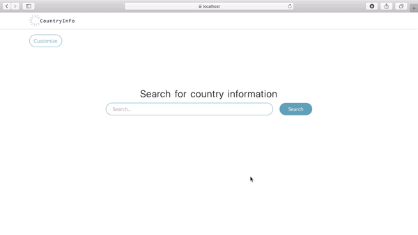
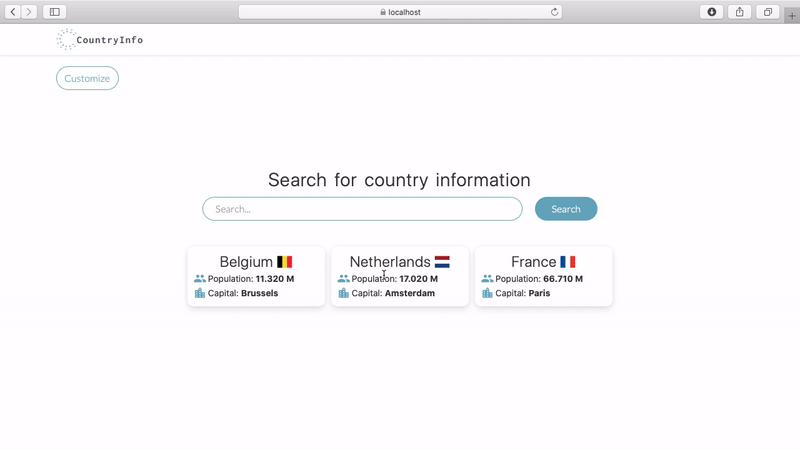

# CountryInfo
##### Blazor WebAssembly application
Main purpose of the app is to represent basic country data downloaded from [REST Countries](https://restcountries.eu) API.
## Search
#### Search for information about country of interest:

## Customize
#### Choose data you want to display:

## ToDo
- Animations for appearing elements
- More customization:
  - Data order
  - Data formatting
- Better customization UI:
  - In form of movable cells allowing to change order
  - Different placement
- Better data presentation:
  - In form of cells
  - Not plain text
- Draggable data cards
- Sugestions during typing
- Change flag source
